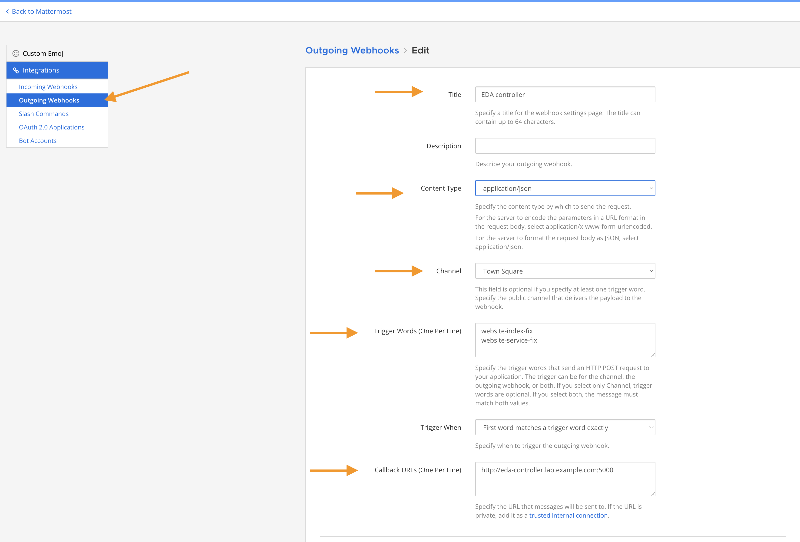
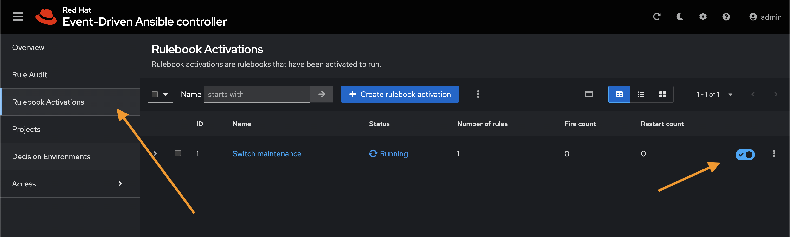
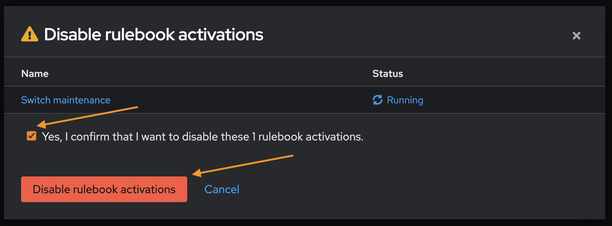
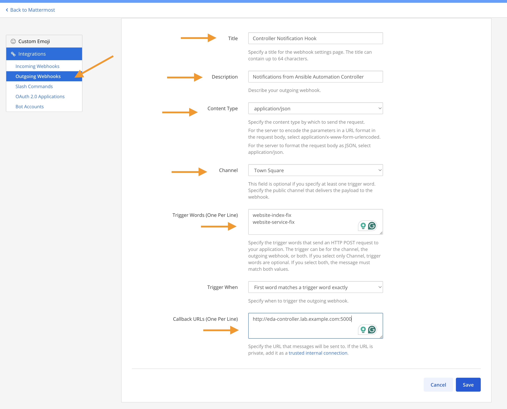
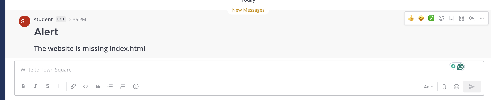
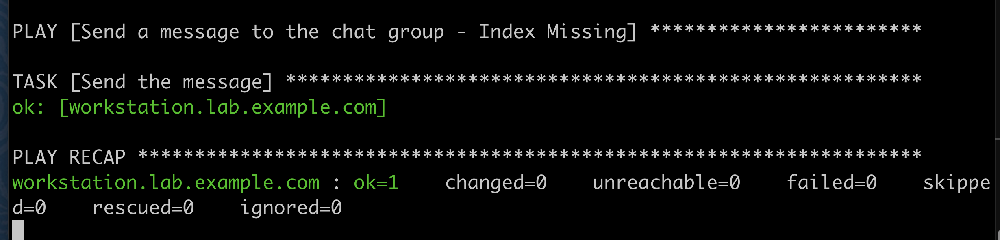
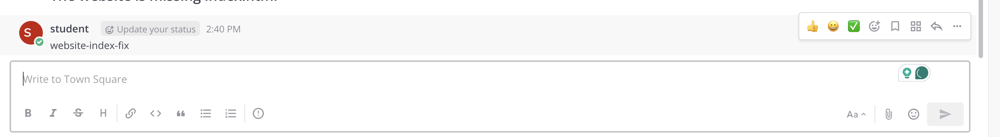
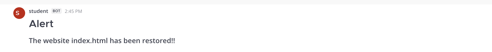
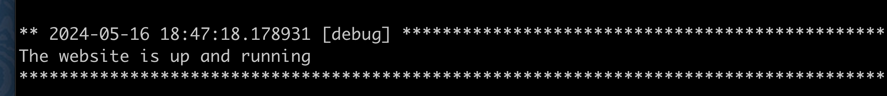

// Initial Settings for Github
ifdef::env-github[]
:status:
:outfilesuffix: .adoc
:caution-caption: :fire:
:important-caption: :exclamation:
:note-caption: :paperclip:
:tip-caption: :bulb:
:warning-caption: :warning:
endif::[]
:revnumber: 1.0

= Running the Demo

The demo for URL Check Mattermost will launch a rulebook locally on workstation which is similar to Chapter 1. However, this rulebook will notify Mattermost with an error message for the website being down because the service is stopped or because the index.html file is missing.

The demo also utilizes EDA controller as a listener that will listen for events from MatterMost and kick off another set of tasks which integrate with Ansible Automation Controller to run a playbook based on the given events. The playbook will then trigger another notification to Mattermost that the event has been resolved.

.Webhook and Mattermost Trigger Phrases

* *website-index-fix*: Used to trigger EDA controller which calls a job on Automation Controller to repair the index.html file and notifiy Mattermost that job is fixed.

* *website-service-fix*: Used to trigger EDA controller which calls a job on Automation Controller to repair the services (systemctl restart httpd) and notifiy Mattermost that job is fixed.

[NOTE]
=====
You must first run the *Setup_Demo.sh* script to ensure all pieces are available. Then you can run the rulebook command. To demonstrate both conditions and fixes, you will need to have a separate window open and delete the *index.html* file and *systemctl stop httpd*.

It is also necessary to configure the WebHooks for Mattermost and ensure they are correct in the playbooks.

.Incoming Webhooks

Incoming webhooks are needed so that Mattermost can receive events and notifications from EDA Controller and rulebooks. This webhook needs to be updated in the playbooks to ensure that they are triggered correctly.

*Incoming Webhook Playbooks*

* *website_notify_down.yml*
* *website_notify_missing_index.yml*

*System Console => Environment => Developer => Allow Untrusted connections* and enter in EDA controller and the 172.25.250.0/24 subnet.

image::images/README-24-05-15-14-42-39.png[title="Allowing Webhooks (System Console - Untrusted Connections)", align="center"]

You also need to setup the WebHook *Integrations => Incoming Webhooks*

image::images/README-24-05-15-14-46-59.png[title="Allowing Incoming Webhooks (Integrations)", align="center"]

image::images/README-24-05-15-14-50-20.png[title="Webhook URL", align="center"]

The *incoming webhook* gets created by the start and setup script, just copy the webhook and place in the playbooks above.

.Outgoing Webhooks

The outgoing webhooks must be configured so that Mattermost can connect and contact the EDA Controller based on the service needed.

*Outgoing Webhook Playbooks*

* *website_notify_down.yml*
* *website_notify_missing_index.yml*

 
=====

[IMPORTANT]
=====
It is very important that if you are using Rulebooks with the *run_playbook* command that the inventory/host specified in the ruleset is the same host as specified in the playbooks, otherwise, there are issues with *no hosts matched*.

[source,bash]
----
PLAY [Send a message to the chat group - Index Missing] ************************
skipping: no hosts matched
----

=====

== Demo Instructions - Mattermost URL Check and Fix Demo

=== Setup for the Demo

. Run the setup script to prepare the environment.
+
[source,bash]
----
[student@workstation ~]$  cd /home/student/Github/DO274_Demo/Demos/CH3/URL_Check_MM_Demo
----
+
[source,bash]
----
[student@workstation URL_Check_MM_Demo]$ ./Setup_Demo.sh

**********************************************
***** Copying Collections ********************

... OUTPUT OMITTED ...

PLAY RECAP ***************************************************************************
servera                    : ok=6    changed=4    unreachable=0    failed=0    skipped=0    rescued=0    ignored=0

SUCCESS Checking lab systems
SUCCESS Installing required software
SUCCESS Performing common exercise tasks
SUCCESS Creating the exercise directory
SUCCESS Preparing the exercise
----
+
The *Setup_Demo.sh* script prepares the lab environment and also calls the *_lab start example-chat_* script to setup and pre-configure MatterMost and some of the server configuration settings there.
+
[IMPORTANT]
=====
The *Setup_Demo.sh* script takes about five (5) minutes to run to completion.
=====

. Disable the *Switch Maintenance Rulebook* in EDA Controller
.. Login to EDA Controller
.. Click *Rulebook Activations* then click the switch to *Disable* the activation
+

.. Confirm *Disable rulebook activations*
+

. Login to Mattermost (http://mattermost.lab.example.com:8065/)
.. *UN/PW*: student/Stud3nt123

. Go to the *System Console => Environment => Developer => Allow Untrusted connections* menu and add the EDA Controller and the classroom subnet.
** eda-controller.lab.example.com
** 172.25.250.0/24
.. Click *Save*
.. Click *Back to labexamplecom*

. Select *Integrations* from the System Menu

. Select Incoming Webhooks
** http://mattermost.lab.example.com:8065/hooks/a8my9aia1fbs9kw97bp87y1g5r
.. Copy the webhook for the playbooks
+
[IMPORTANT]
=====
This webhook will hopefully be the same and no change would need to be made to the playbooks. If that is the case, we are just verifying. However, if a change needs to be made to the webhook, it should be copied and applied to the playbook.

The playbooks that would need to be modified are located in the DO274_Demo project and would not need to be updated in Github.

* */home/student/Github/DO274_Demo/Demos/CH3/URL_Check_MM_Demo/website_notify_index_missing.yml*
* */home/student/Github/DO274_Demo/Demos/CH3/URL_Check_MM_Demo/website_notify_down.yml*

=====

. Return to the *Integrations* from the System Menu and select *Outgoing Webhooks*

. Click *Add Outgoing Webhook*
** *TITLE*: Controller Notification Hook
** *Description*: Notifications from Ansible Automation Controller
** *Content Type*: application/json
** *Channel*: Town Square
** *Trigger Words*
*** website-index-fix
*** website-service-fix
** *Callback URL*: http://eda-controller.lab.example.com:5000 
+

.. Click *Save*
.. Click *Done*

=== Running the Demo

. Create the *EDA Controller* Rulebook Activation
.. Navigate to *Rulebook Activations*
.. Click *Create Rulebook Activation*
** https://eda-controller.lab.example.com/overview
.. Complete the Web Form
** *Name*: DEMO EDA MatterMost
** *Project*: Weebsite Maintenance Demo
** *Rulebook*: web_mattermost_demo.yml
** *Decision Environment*: Automation Hub Default Decision Environment
** *Controller Token*: controller.lab.example.com

. Launch the *url_check.yml* Rulebook
+
.Running the Rulebook on Workstation
[source,bash]
----
[student@workstation URL_Check_MM_Demo]$ ansible-rulebook -r url_check.yml -i inventory
----

. In another window or frame, SSH to ServerA as root so that you can stop the services or delete the *index.html* file.
+
[source,bash]
----
[student@workstation ~]$ ssh root@servera
----

. Delete the */var/www/index.html* file and observe the Rulebook and Mattermost notifications.
+
[source,bash]
----
[root@servera ~]# rm /var/www/html/index.html
rm: remove regular file '/var/www/html/index.html'? y
----
+

+

. Type *website-index-fix* in the MatterMost *Town Square* channel.
+

. Verify that the website is up and running via the MatterMost alert and the running rulebook
+

+

[TIP]
=====
The process can be repeated for the *httpd* service. In order to test the service triggers, run *systemctl stop httpd* on serverA and to fix the service, type *website-service-fix* in Mattermost.

It is also important that again, the URLs might need changed for the incoming webhooks. If this is the case, please submit an issue as I can turn this into a variable for Ansible Automation Controller as there is no direct "commit" access for my main branch. Another solution would be to "fork" the repository and make it your own.

Playbooks that need to be modified for the Ansible Automation Controller are in the *DO274 Demo Project* which belong to the https://github.com/tmichett/AAP2_Demos.git repository.

.Playbooks to modify the URL for MatterMost Incoming Webhook
* website_notify_index_restored.yml
* website_notify_service_restored.yml

The Webhook being used should be part of the course, but it may change with course updates.
=====

== Repositories and Items in Demo

There are several public repositories used in this demo. The reason these needed to be used is based on the project structure, file locations, and because they are also shared resources in other courses.

* *Controller Playbooks*: https://github.com/tmichett/AAP2_Demos
* *EDA Controller Rulebooks*: https://github.com/tmichett/do274_eda_rulebooks
* *Main Demo Repository*: https://github.com/tmichett/DO274_Demo