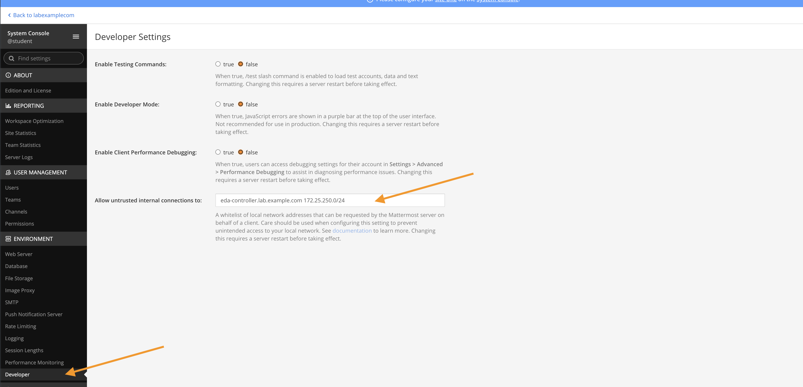
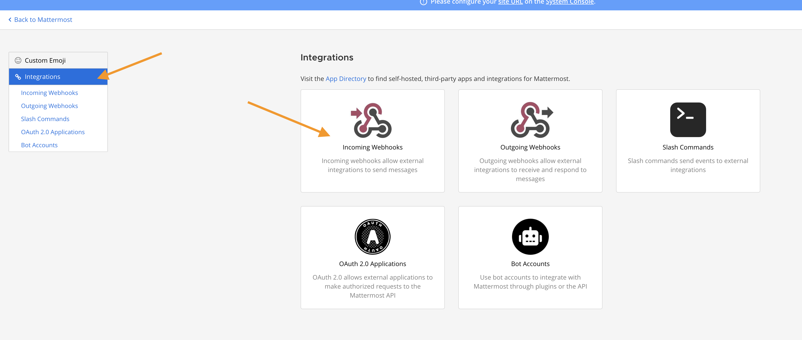
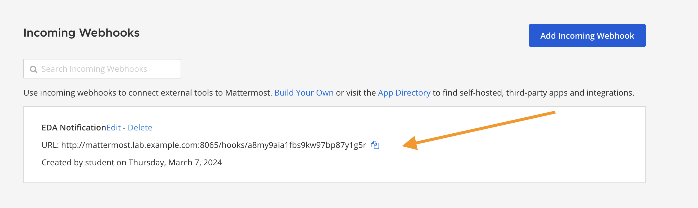

// Initial Settings for Github
ifdef::env-github[]
:status:
:outfilesuffix: .adoc
:caution-caption: :fire:
:important-caption: :exclamation:
:note-caption: :paperclip:
:tip-caption: :bulb:
:warning-caption: :warning:
endif::[]
:revnumber: 1.0

= Running the Demo

[source,bash]
----
[student@workstation URL_Check_MM_Demo]$ ansible-rulebook -r url_check.yml -i inventory
----

[NOTE]
=====
You must first run the *Setup_Demo.sh* script to ensure all pieces are available. Then you can run the rulebook command. To demonstrate both conditions and fixes, you will need to have a separate window open and delete the *index.html* file and *systemctl stop httpd*.

It is also necessary to configure the WebHooks for Mattermost and ensure they are correct in the playbooks.

* *website_notify_down.yml*
* *website_notify_missing_index.yml*

*System Console => Environment => Developer => Allow Untrusted connections* and enter in EDA controller and the 172.25.250.0/24 subnet.

You also need to setup the WebHook *Integrations => Incoming Webhooks*

The *incoming webhook* gets created by the start and setup script, just copy the webhook and place in the playbooks above.

=====

[IMPORTANT]
=====
It is very important that if you are using Rulebooks with the *run_playbook* command that the inventory/host specified in the ruleset is the same host as specified in the playbooks, otherwise, there are issues with *no hosts matched*.

[source,bash]
----
PLAY [Send a message to the chat group - Index Missing] ************************
skipping: no hosts matched
----

=====

== Repositories and Items in Demo

* *Controller Playbooks*: https://github.com/tmichett/AAP2_Demos
* *EDA Controller Rulebooks*: https://github.com/tmichett/do274_eda_rulebooks
* *Main Demo Repository*: https://github.com/tmichett/DO274_Demo